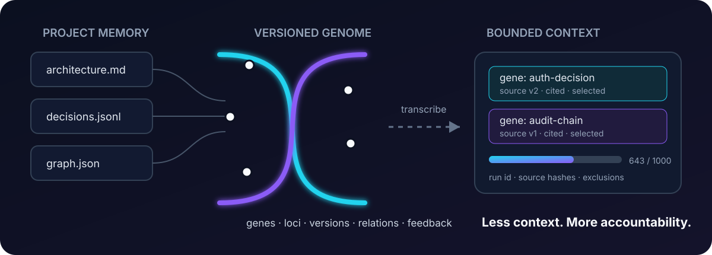

<p align="center">
  
</p>

<p align="center">
  <strong>Give your AI less context — and receipts for every choice.</strong>
</p>

<p align="center">
  <a href="README.md">English</a> · <a href="docs/translations/README.pt-BR.md">Português (Brasil)</a>
</p>

<p align="center">
  <a href="https://github.com/tallesnicacio/genomefy/actions/workflows/tests.yml"></a>
  
  
  <a href="LICENSE"></a>
</p>

Genomefy is a local context-memory layer for AI assistants. It turns project knowledge into small, versioned units, retrieves only the evidence needed for a question, and records exactly why each unit was selected or excluded.

- **Local-first, no paid API required.** The core uses Python, SQLite and FTS5. Retrieval makes no LLM call.
- **Every selected unit carries evidence.** Source path, version, SHA-256 hash, confidence and selection reasons travel with the context.
- **Every query is replayable.** Runs, explicit feedback and memory changes live in an append-only, hash-linked audit trail.

Genomefy borrows names from biology — genes, loci, promoters, repressors, splicing and epigenetic marks — as an interface model. The implementation is conventional software running on ordinary binary hardware.

<p align="center">
  
</p>

## Get started

```bash
git clone https://github.com/tallesnicacio/genomefy.git
cd genomefy
python -m pip install -e .
```

Create a project-local memory and ingest Markdown or text files:

```bash
genomefy --root /path/to/project init
genomefy --root /path/to/project ingest docs docs
genomefy --root /path/to/project query "Why did we choose rotating refresh tokens?" --budget 900
```

The result is a bounded context transcript:

```text
[GENE gene:auth-decision] Authentication decision
The system uses short-lived signed session tokens and rotates refresh tokens...
[CITATION architecture.md:12 | src:...:v2 | confidence=1.00]

[AUDIT run=run:1781... tokens=107/180 counter=regex-estimate-v1]
```

Inspect the full decision trail:

```bash
genomefy --root /path/to/project audit run:1781...
genomefy --root /path/to/project audit verify
```

## What it promises

Genomefy is designed to test one concrete hypothesis:

> A structured, regulated memory can send substantially less context to an AI without materially reducing answer coverage, while keeping citations and retrieval decisions auditable.

The initial success gate is fixed before evaluation:

| Metric | Required result |
|---|---:|
| Context-token reduction | **≥ 25%** against the strongest baseline |
| Key-fact coverage | no more than **2 percentage points lower** |
| Citation accuracy | **≥ 95%** |
| Minimum sample for `PASS` | **30 questions** |

A smaller suite can be `INCONCLUSIVE` or `FAIL`, never `PASS`.

## Current evidence — honest by design

The versioned benchmark suites currently report:

| Questions | Comparator | Context reduction | Quality delta | Citation accuracy | Outcome |
|---:|---|---:|---:|---:|---|
| 8 | local graph baseline | **37.28%** | **0.00 pp** | **100%** | `INCONCLUSIVE` |
| 60 | full context | **92.54%** | **-4.17 pp** | **100%** | `FAIL` |
| 60, known-suite post-fix | full context | **92.50%** | **0.00 pp** | **100%** | `PASS`* |

The smoke suite remains `INCONCLUSIVE` because eight questions are not enough for `PASS`. The frozen 60-question controlled retrieval suite is a real negative result: token reduction, citation integrity and deterministic stability passed, while the overall quality and worst-category gates failed. Facet-aware retrieval then passed every frozen gate with 100% key-fact coverage on the same suite. `PASS`* is a post-hoc engineering regression result on a known suite, not independent confirmation. See the [original Stage 2 report](benchmarks/results/STAGE2_REPORT.md) and [post-fix evolution report](benchmarks/results/STAGE2_POSTFIX_REPORT.md).

See [the benchmark protocol](docs/BENCHMARK.md) and the machine-readable [protocol configuration](benchmarks/protocol.json).

## How it works

```text
documents / JSONL / optional Graphify graph
                     │
                     ▼
       versioned genes + loci + relations
                     │
              question + task
                     │
                     ▼
 exact + FTS promoters → graph expansion (≤2 hops)
                     │
                     ▼
 task modifiers + repressors + bounded feedback marks
                     │
                     ▼
 token-budgeted splicing → cited context transcript
                     │
                     ▼
         run record + hash-linked audit event
```

| Biological metaphor | Concrete implementation |
|---|---|
| Gene | A small, addressable unit of project knowledge |
| Locus | Stable identity shared by versions of the same subject |
| Allele | A source version; older versions remain traceable |
| Promoter | Exact and FTS5 retrieval channels combined with RRF |
| Repressor | Explicit negative terms, suppression and bounded filters |
| Splicing | Deterministic selection under a token budget |
| Epigenetic mark | A bounded ±10% utility modifier from explicit feedback only |
| Transcript | The final cited context passed to an AI |

## What you get

| Capability | What Genomefy provides |
|---|---|
| **Versioned memory** | Changed sources create new versions without silently erasing history |
| **Bounded retrieval** | Exact/FTS promoters, reciprocal-rank fusion and graph expansion limited to two hops |
| **Context compiler** | Deterministic relevance, novelty and budget selection with inclusion/exclusion reasons |
| **Explicit learning** | Only accepted/rejected user feedback changes utility; silence changes nothing |
| **Audit integrity** | SHA-256 checks for genes and run transcripts plus an append-only event hash chain |
| **Multiple inputs** | Markdown/text, canonical JSONL and optional Graphify `graph.json` |
| **Multiple interfaces** | Python library, CLI, optional local MCP server and Codex skill |
| **Measurement harness** | Full-context, local-RAG and local-graph baselines, ablations and 10,000-sample paired bootstrap |

## Graphify + Genomefy

[Graphify](https://github.com/Graphify-Labs/graphify) maps how knowledge is connected. Genomefy decides which part of that knowledge should become context **now**, under a budget, with version and feedback history.

```bash
genomefy --root /path/to/project ingest graphify graphify-out/graph.json
```

The adapter is optional. Genomefy works without Graphify installed and the local benchmark's `graph_baseline` is not presented as an official Graphify benchmark.

## Codex skill

From a source checkout:

```bash
genomefy skill install --global
```

In a new Codex session, invoke `$genomefy`. The default workflow retrieves context, answers with source locations and appends a compact audit summary. It never infers feedback from silence.

## Optional MCP server

```bash
python -m pip install -e ".[mcp]"
genomefy --root /path/to/project mcp serve
```

Tools exposed locally: `genomefy_query`, `genomefy_explain`, `genomefy_feedback` and `genomefy_status`.

## DNA Graph

The planned visual layer renders memory as an inspectable double helix: knowledge on one strand, evidence on the other, with selected loci forming a linear “context RNA” transcript. The 2D audit view comes first; 3D is only justified if it improves a measured navigation or comprehension task.

Read the [DNA Graph specification](docs/DNA_GRAPH_VISUALIZATION.md).

## What it does not promise

- It does not make the underlying model more intelligent.
- It does not make ingested sources true.
- It does not provide infinite or DNA-based physical computation.
- It does not call a small smoke test scientific proof.
- It does not hide inferred, historical or excluded evidence behind a visual metaphor.

## Development

Genomefy's core has no required third-party runtime dependency.

```bash
python -m pip install -e .
python -m unittest discover -s tests -v
python -m genomefy --root benchmarks/fixtures benchmark run \
  benchmarks/fixtures/smoke-suite.json
```

See [CONTRIBUTING.md](CONTRIBUTING.md) and [SECURITY.md](SECURITY.md).

## Status

Genomefy `0.2.0` is an experimental but functional release. The storage, facet-aware retrieval, temporal allele selection, replay, audit, benchmark and skill-install paths are implemented and tested. The original controlled 60-question run remains `FAIL`; the known-suite post-fix regression is `PASS` with 100% coverage. Independent confirmation, local embeddings, end-to-end answer evaluation, the licensed 300-question suite and DNA Graph UI remain future work.

## License

Apache-2.0.
